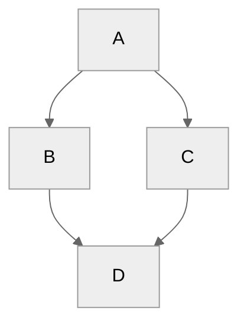

+++
title = 'This Site'
date = 2024-09-12T16:50:57+02:00
draft = false
math = true
type = 'docs'
+++

This site is built with [hugo](https://gohugo.io/), [hextra (a hugo theme)](https://imfing.github.io/hextra/),
and includes some pages with embedded WASM built with [emscripten](https://emscripten.org/)

## supported features

### Code

```cpp
std::cout<<"Hello, World!"<<std::endl;
```

### Maths & Chemistry

Inline LaTeX: `$\sigma(z) = \frac{1}{1 + e^{-z}}$` = $\sigma(z) = \frac{1}{1 + e^{-z}}$

Separate Paragraph LaTeX:

```latex
$$F(\omega) = \int_{-\infty}^{\infty} f(t) e^{-j\omega t} \, dt$$
```

$$F(\omega) = \int_{-\infty}^{\infty} f(t) e^{-j\omega t} \, dt$$

Chemistry expressions with `mhchem`: `$H_2O$` $H_2O$

### Mermaid Graphs

```md
graph TD;
A-->B;
A-->C;
B-->D;
C-->D;
```


