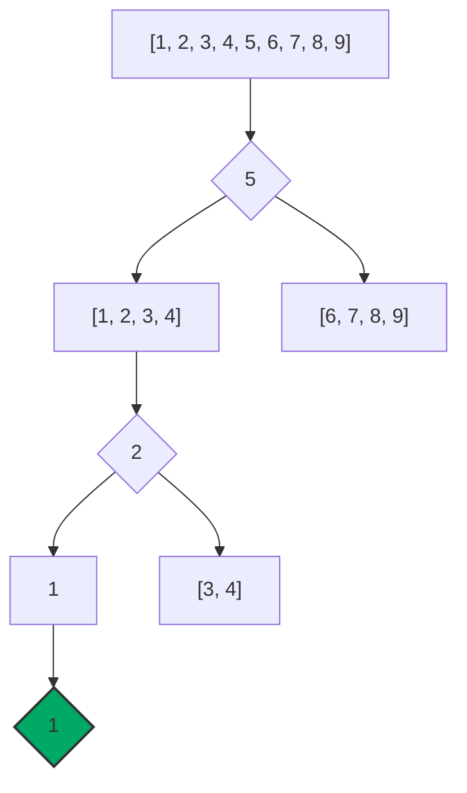

+++
title = 'Binary Search'
date = 2024-09-14T18:49:48+02:00
draft = false
math = true
+++

Finds the position of a target value within a _sorted array_,
by iteratively halving the input array.

Time Complexity: $O(logn)$
Space Complexity: $O(1)$

## Algorithm

1. Compare the target value to the middle element of the array.
   - If it is equal, we are done.
   - Otherwise, move to looking at either the left or right half of the middle element.
2. Select the middle element of this half of the array, and start again.
3. The search ends when either the value is found,
   or the remaining half is empty (not found).

For an input of `[1, 2, 3, 4, 5, 6, 7, 8, 9]` the steps for finding `1` are:



```cpp
#include <optional>
#include <vector>

template<typename T>
std::optional<std::size_t> binary_search(const std::vector<T>& sortedVec, T target) {
  std::size_t right = sortedVec.size() -1;
  std::size_t left = 0;
  std::size_t mid = 0;

  while(left <= right) {
    mid = left + (right - left) / 2;
    const auto& val = sortedVec[mid];
    if (target == val) {
      return mid;
    } else if (target > val) {
      left = mid + 1;
    } else if (target < val) {
      right = mid - 1;
    }
  }
  return std::nullopt;
}

int main() {
  std::vector<int> vec = {1, 2, 3, 4, 5, 6, 7, 8, 9, 10, 11, 12, 13, 14};
  int target = 7;
  auto res = binary_search(vec, target);
  return (res.has_value() ? res.value() : 69) ;
}
```
