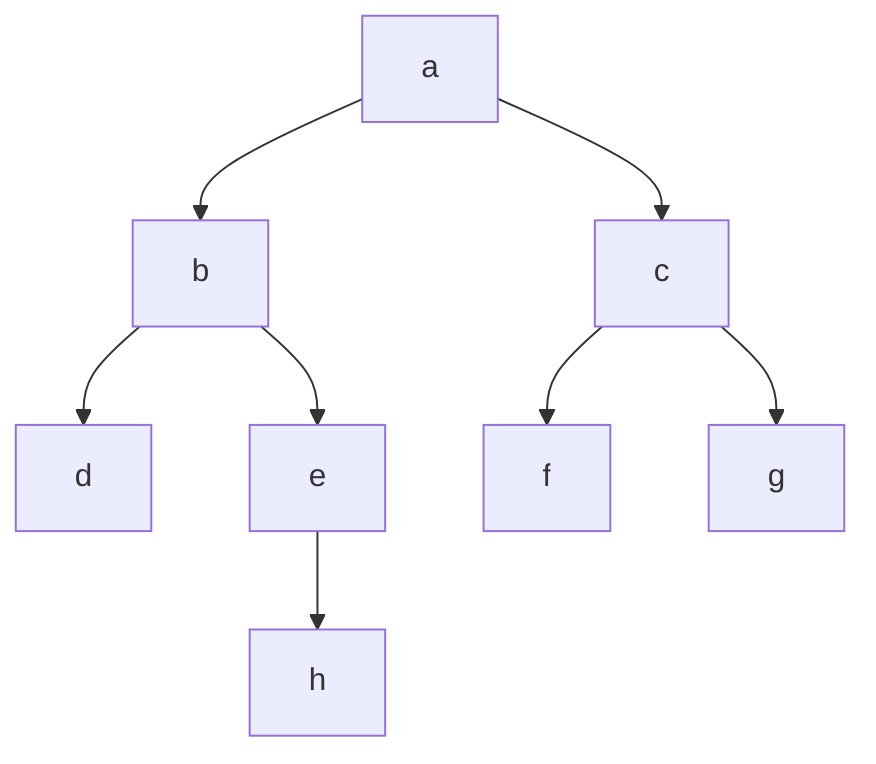

+++
title = 'Breadth-first Search'
date = 2024-09-14T18:49:48+02:00
draft = false
math = true
tags = ["search", "bfs", "binary-first-search"]
+++

Used for searching graph data structures for a node that satisfies a given property.
It starts a given node (the root for a tree), and explores all directly connected
nodes before moving on to nodes at the next depth level.
Extra memory, usually a queue, is used to keep track of child nodes not-yet explored.

NB: The algorithm can be applied to an implicit tree
(where the next nodes are discovered while iterating).

Typically, requires more memory than Depth-first search,
but it won't get stuck in a potentially infinite branch.

## Algorithm

In general, BFS uses a queue (FIFO), instead of a stack (LIFO).
If working on a tree, replacing the queue with a stack would yield a
[DFS]().

Steps:

1. Initialize: Create an empty queue to store nodes to visit,
   Mark all nodes as unvisited.
   Enqueue the starting node and mark it as visited.
2. Visit: While the queue is not empty:
   Dequeue a node from the front of the queue (let's call this currentNode).
   For each neighbor of currentNode that has not been visited yet, enqueue it,
   mark it as visited, and set its predecessor to be currentNode.
3. Repeat: Repeat step 2 until all nodes have been visited,
   or a termination condition is met.
   The queue will eventually empty itself once all reachable nodes are discovered.
4. Output: Optionally, you can keep track of the path taken from the start node
   to each node for output or further processing.
   This could be done by storing predecessor information during step 2.

Complexity: BFS has a time complexity of $O(V + E)$ where $V$ is the number of
vertices and $E$ is the number of edges, because it visits all nodes and explores
all their neighbours ($O(E)$).
The space complexity is also $O(V)$ for storing visited status and queue elements.

Given this tree:



Iteration would be over `a`, `[b, c]`, `[d, e]`, `[f, g]`, `h`.

### Non-recursive

```cpp
#include <queue>
#include <unordered_set>
#include <utility> // For std::pair
#include <vector>

struct Node {
  std::vector<Node*> neighbors;
  Node* parent = nullptr;
};

Node* BFS(Node* root) {
  std::queue<Node*> q;
  std::unordered_set<Node*> explored;

  q.push(root);
  explored.insert(root);

  while (!q.empty()) {
    Node* v = q.front();
    q.pop();

    if (v->parent != nullptr) {
      continue;
    }

    for (Node* w : v->neighbors) {
      if (!explored.contains(w)) {
        explored.insert(w);
        w->parent = v;
        q.push(w);
      }
    }
  }
  return nullptr;
}
```
