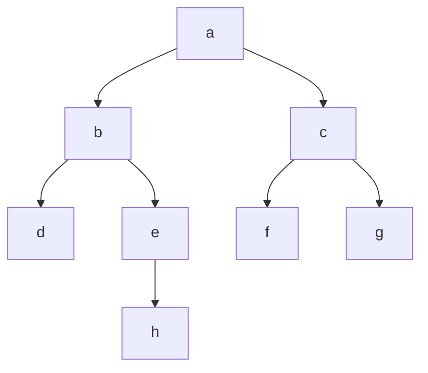

+++
title = 'Depth-first Search'
date = 2024-09-14T18:49:48+02:00
draft = false
math = true
tags = ["search"]
+++

Used for searching graph data structures for a node that satisfies a given property.
It starts a given node (the root for a tree), and explores as far as possible along
each branch before backtracking to the next.
Extra memory, usually a stack, is used to keep track of child nodes not-yet explored
(for backtracking).

NB: The algorithm can be applied to an implicit tree
(where the next nodes are discovered while iterating).

Typically, requires less memory than Breadth-first search,
but it might get stuck in a potentially infinite branch.

## Algorithm

1. Initialize a stack to keep track of nodes to visit,
   starting with the root node (or any start node).
2. Mark the initial node as visited. If it's not already marked,
   mark it in your data structure representing "visited" nodes.
3. While the stack is not empty: Pop a node from the top of the
   stack and call it `current`.
4. For each unvisited neighbour of `current`:
   - Mark this neighbour as visited.
   - Push this neighbour onto the stack.
5. Repeat until the stack is empty, ensuring all nodes are visited exactly
   once unless there's a cycle or other constraints dictate differently.

If you need to find paths or detect cycles, consider additional data structures
like parent pointers and checks during traversal (e.g. checking if a neighbour has
already been visited).

Given this tree:



Iteration would be over `a`, `b`, `d`, `e`, `h`, `c`, `f`, `g`.

### Non-recursive Implementation

Would traverse the graph right-to-left.

```cpp
void DFS(std::vector<node*>& graph, node* root){
  std::vector<node*> frontier;
  frontier.push(root);
  while (!frontier.empty()) {
    auto* v = frontier.pop();
    if (!v->was_visited) {
      v->was_visited;
      for (auto* neighbour : v->neighbours()) {
        frontier.push(neighbour);
      }
    }
  }
}
```

### Recursive Implementation

Would traverse the graph left-to-right.

```cpp

void DFS(node* vertex) {
  v->was_visited = true;
  for(auto* neighbour : v->neighbours) {
    if(!neighbour->was_visited) {
      DFS(neighbour);
    }
  }
}
```

### Iteratively-deepening DFS
