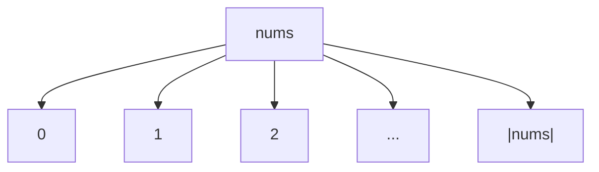
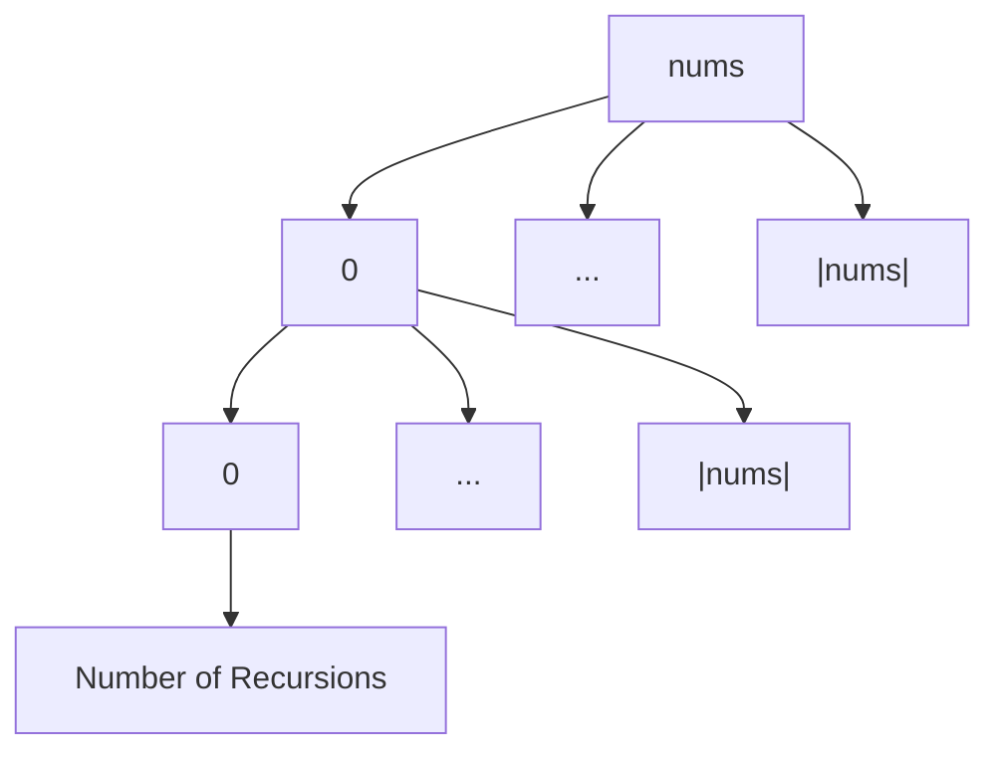

+++
title = 'Big-O Time'
date = 2024-09-14T18:49:48+02:00
draft = false
math = true
tags = ["time-complexity", "big-o"]
+++

NB: drop variables that are used in larger expressions: $O(n + nm)$ = $O(nm)$

## Comparison

- Constant time $O(1)$: Algorithm is not dependent on the input size.
- Logarithmic time $O(logn)$: input size is halved upon each iteration.
- Linear time $O(n)$: scales directly with the input.
- Polynomial/Quadratic time $O(n^x)$/$O(n^2)$: scales with the input size$^x$ (nested iteration).
- Exponential time $O(x^n)$: algorithm complexity is multiplied by $x$ for each element in input.
  E.g. Naive recursive Fibonacci is $O(2^n)$ as `f()` is called twice for each element in input.

## Using a call-tree to derive the Big-O

When there is recursion (or looping), make a call-tree, and inspect it:

- NB: trees are not always $logn$ height, or balanced
- L = levels per tree = how many iterations occur per op
- C = children per node = how many ops occur per iteration
- Time Complexity = $O(C^L)$
- Space Complexity = $O(L)$ (based off of how n relates to L)

### A Loop

```cpp
for(auto x : nums)
  x;
```



$O(|nums|) = O(n)$

### A Nested Loop

```cpp
for(auto x : nums)
  for(auto y : nums)
    x+=y;
```



$n = |nums|$

$x = depth$ (Number of Recursions)

$O(n_0 * ... * n_x) = O(n^2)$

It is still $n^2$ even if the second iteration only went over a part of $n$

## Logarithmic Time
