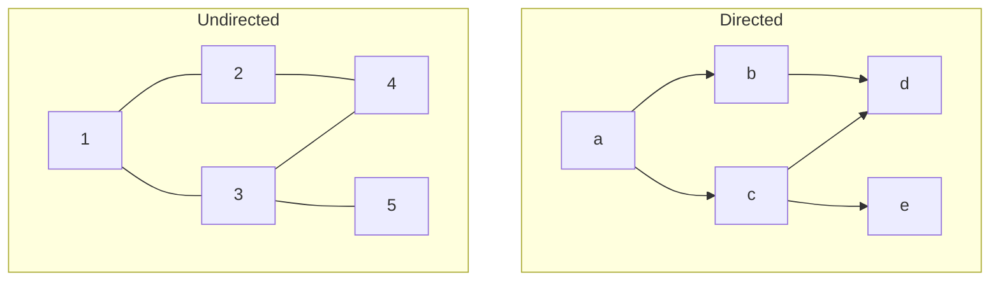
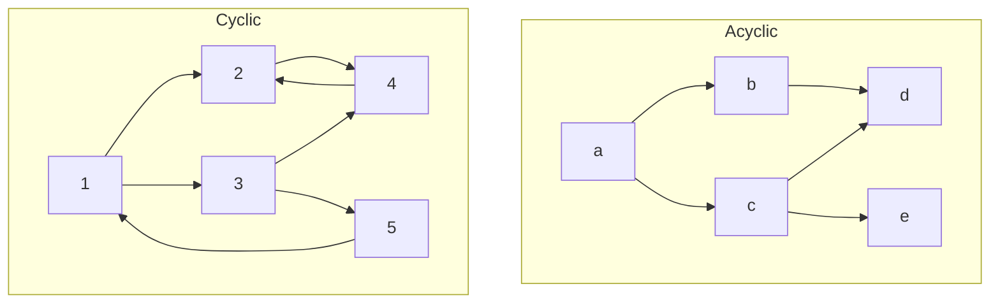

+++
title = 'Graphs'
date = 2024-09-14T18:50:06+02:00
draft = false
math = true
tags = ["data-structure", "graph"]
+++

Graphs are data structures that represent nodes/items (vertices),
and their connections (edges).

## Directed-ness

Graphs can be _directed_: The edges of the graph specify a connection
from one node to another (in a single direction).
_Undirected_ graphs have edges that are (implicitly) bi-directional.

## Cycles

Graph can be _A/Cyclic_: Acyclic graphs have connections that do not form any loops
(cycles), whereas _cyclic_ graphs do.

## Implementations

Graphs are often implemented in one of two ways.

1. A set of nodes/vertices, with a separate map containing the edges for each node
   (called an "Adjacency List").
2. A node structure where the nodes themselves store a list of pointers to the
   other nodes they are connected to.

## To-do

- Graph
  - Trees
    - Tries
    - Binary Tree
    - Red-Black Tree
    - Radix-trees
    - ...
  - Linked Lists
