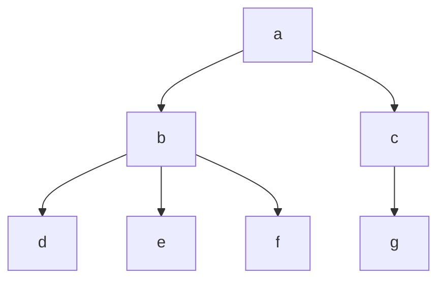

+++
title = 'Trees'
date = 2024-09-17T11:48:00+02:00
draft = false
math = true
tags = ["data-structure", "graph", "tree", "binary-tree"]
+++

Trees are a special form of DAGs (Directed-Acyclic-Graphs)
wherein each node (starting at the first/root) is connected to N other nodes (uniquely).

E.g. Here we have a tree, note how vertices on the same level do not connect
to each other, but can share an ancestor.

## Implementation

Trees much like graphs, are often implemented in one of two ways.

1. A set of elements, with a separate map containing the edges for each element to
   their children (called an "Adjacency List").
2. A node structure where the nodes themselves store a list of pointers to its children.

## Balancing

Balancing a tree is the process of ensuring that the tree's height is minimized
so that operations on it can be performed efficiently. In a balanced tree, the depths
of the left and right subtrees of any node differ by at most a small constant factor
(usually 1). This prevents a tree from degenerating into a linear structure
(like a linked list), which would cause inefficiencies.
Unbalanced trees are often referred to as _skewed_.

### Methods of Balancing

- _Rotations_: In trees such as AVL and Red-Black Trees, rotations are used when
  imbalances are detected during insertion or deletion.
- _Rebuilding/Splitting_: In some cases, the tree is partially or fully rebuilt
  when it becomes imbalanced.

### Self Balancing Trees

Some tree structures are self-balancing.

- _AVL Tree_: Balances by maintaining a strict height difference of 1 between subtrees.
- _Red-Black Tree_: Ensures a "balanced enough" structure with colour-based
  partitioning/balancing rules.
- _B-Trees (and B+ Trees)_: Used in DBs and file systems to keep trees balanced across
  multiple nodes, optimized for disk access.
