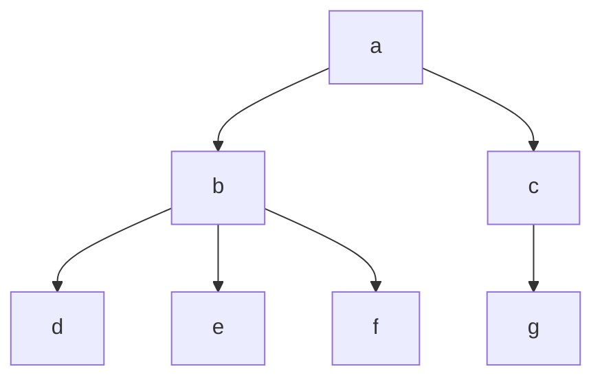

+++
title = 'Trees'
date = 2024-09-17T11:48:00+02:00
draft = false
math = true
tags = ["data-structure", "graph", "tree", "binary-tree"]
+++

Trees are a special form of DAGs (Directed-Acyclic-Graphs)
wherein each node (starting at the first/root) is connected to N other nodes (uniquely).

E.g. Here we have a tree, note how vertices on the same level do not connect
to each other, but can share an ancestor.

## Implementation

Trees much like graphs, are often implemented in one of two ways.

1. A set of elements, with a separate map containing the edges for each element to
   their children (called an "Adjacency List").
2. A node structure where the nodes themselves store a list of pointers to its children.
