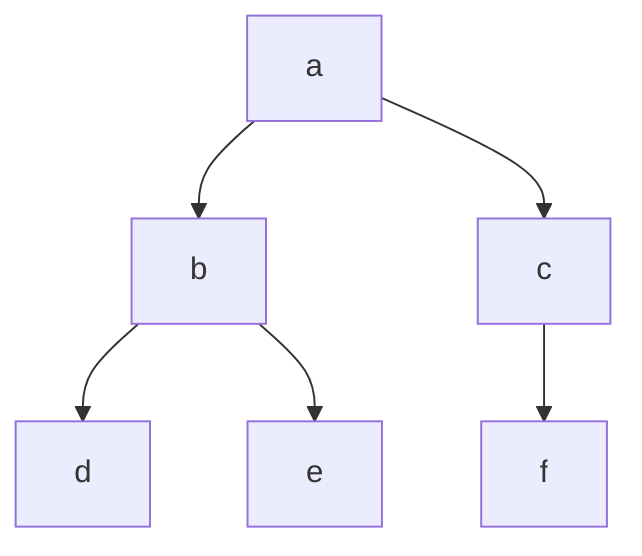

+++
title = 'Binary Tree'
date = 2024-09-17T11:48:11+02:00
draft = false
math = true
tags = ["data-structure", "graph", "tree", "binary-tree"]
authors = ["Johnathan Jacobs"]
+++

Binary trees are trees wherein each node has at most 2 children.

## Implementation

Usually binary trees are implemented as a node with two pointers to its children.
