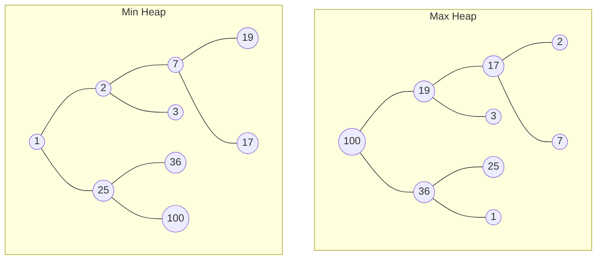

+++
title = 'Heaps'
date = 2024-09-17T11:44:38+02:00
draft = false
math = true
tags = ["data-structure", "graph", "tree", "heap"]
+++

A heap is a tree-based data structure that satisfies the heap property:

- _Max Heap_: All nodes have a parent whose value is _greater_ than or equal to theirs.
- _Min Heap_: All nodes have a parent whose value is _less_ than or equal to theirs.

The node at the top (with no parents) is called the _root_ node.

Heaps are:

- Not a sorted structure, but are _partially ordered_.
- An efficient implementation of a priority-queue.
- Useful when it is necessary to repeatedly remove the object with the
  highest/lowest priority, or when insertions need to be interspersed
  with removals of the root node.
- More efficient to construct from an existing array, than to iteratively build.

## Example

Given the array `[1, 2, 3, 7, 17, 19, 25, 36, 100]`

- The resulting max-heap array would be `[100, 19, 36, 17, 3, 25, 1, 2, 7]`
- The resulting min-heap array would be `[1, 2, 25, 7, 3, 36, 100, 19, 17]`
- The resulting trees would be:



## Applications

- Selection algorithms
- Priority Queues
- Traversing graphs
  - Prim's Minimum-Spanning-tree algorithm
  - Dijkstra's shortest-path algorithm
- K-Way merge: merging many already-sorted inputs into a single sorted output

## Operations

Common operations on a heap:

- Basic:
  - Find min/max (peek)
  - Insert (push)
  - Extract min/max (pop), removes the element, then returns it.
  - Delete min/max, remove the root node of the heap.
  - Replace: pop root and push a new key. Better than a pop,
    then push as it only needs to balance the tree once.
- Creation:
  - Create Heap
  - Heapify: create a heap out of a given array of elements.
  - Merge (union) two heaps to form a new heap, preserving the original heaps.
  - Meld two heaps to form a new heap, destroying the originals.
- Internal:
  - Update-key
  - Delete (followed by moving the last node and sifting to maintain the heap).
  - Sift-Up: Move a node up in the tree as long as needed; Used to restore the heap
    condition after insertion.
  - Sift-Down: Move a node down in the tree to restore the heap condition after
    deletion or replacement.

## Implementation

Heaps are typically constructed in-place in the same array where the elements are
stored, with their structure being implicit in the access pattern of the operations.
Heaps differ in this way from other data structures such as Radix trees in that they
don't require extra memory beyond what's used to store the keys.

For a binary heap, the first index into the array contains the root element.
The next two indices contain the root's children, and the next four contain
their children. This pattern continues, for any node at index $i$, its children
are at indices $2i + 1$ and $2i + 2$, and its parent's index is $(i-1)/2$.

Balancing a heap is done by sift up/down operations (swapping elements that are out of order),
[heapsort]()
can be used to sort the array in place.

The most common implementation for operations:

- _Insertion_: Add the new element at the end of the heap (in the first available free space).
  If this violates the heap property, sift up the new element
  until the heap property is re-established.
- _Extraction_: Remove the root and insert the last element of the heap in the root.
  If this violates the heap property, sift down the new root until it is re-established.
- _Replacement_: Remove the root and put the new element in its place, and sift down.

Different variants exist for heaps based off of how many children each node is assigned.

### C++ Binary Min Heap

Time and Space Complexity:

- siftUp(): $O(log n)$ time, $O(1)$ space
- siftDown(): $O(log n)$ time, $O(1)$ space
- insert(): $O(log n)$ time, $O(1)$ space
- extractMin(): $O(log n)$ time, $O(1)$ space
- replace(): $O(log n)$ time, $O(1)$ space

```cpp
#include <vector>
#include <algorithm> // std::swap
#include <cassert>

// Alternative: using std::make_heap, std::push_heap,
//              std::pop_heap for simpler heap operations.
class MinBinaryHeap {
  std::vector<int> heap;

  void siftUp(size_t idx) {
    while (idx > 0) {
      size_t parent = (idx - 1) / 2;
      if (heap[parent] <= heap[idx]) break;
      std::swap(heap[parent], heap[idx]);
      idx = parent;
    }
  }

  void siftDown(size_t idx) {
    size_t n = heap.size();
    while (true) {
      size_t left = 2 * idx + 1, right = 2 * idx + 2, smallest = idx;
      if (left < n && heap[left] < heap[smallest]) smallest = left;
      if (right < n && heap[right] < heap[smallest]) smallest = right;
      if (smallest == idx) break;
      std::swap(heap[idx], heap[smallest]);
      idx = smallest;
    }
  }

public:
  void push(int value) {
    heap.push_back(value);
    siftUp(heap.size() - 1);
  }

  [[nodiscard]] int pop() {
    int minVal = heap[0];
    heap[0] = heap.back();
    heap.pop_back();
    siftDown(0);
    return minVal;
  }

  [[nodiscard]] int peek() {
    return heap[0];
  }

  int replace(int value) {
    // heap[0] = value;
    std::swap(heap[0], value);
    siftDown(0);
    return value;
  }

  bool empty() const { return heap.empty(); }
};

int main() {
  MinBinaryHeap test;
  test.push(5);
  test.push(3);
  test.push(9);
  test.push(1);
  assert(test.pop() == 1);
  assert(test.peek() == 3);
  assert(test.replace(0) == 3);
  assert(test.pop() == 0);
  assert(test.pop() == 5);
  test.push(2);
  assert(test.pop() == 2);
}
```
