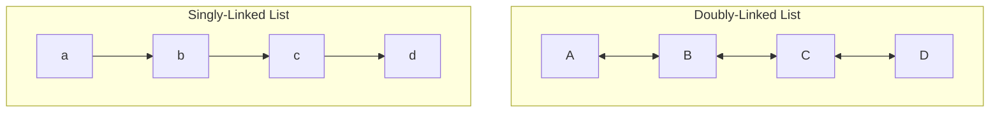

+++
title = 'Linked Lists'
date = 2024-09-17T11:47:38+02:00
draft = false
math = true
tags = ["data-structure", "graph", "linked-list", "tree"]
+++

A link list is a special case of a tree, where each node is connected
to at most one other node (singly-linked) or two other nodes (doubly-linked).
Nodes can only ever be linked to the next node, or the next and the previous node.



## Singly-Linked List

### Usage

- Efficient insertion/deletion at the front: O(1) for push_front and pop_front,
  which makes it ideal for a stack-like structure.
- Simple traversal: If you only need forward traversal, a singly-linked list is
  simpler and more space-efficient than a doubly-linked list.
- When space is a concern: Singly-linked lists are more memory-efficient than
  doubly-linked lists due to the single pointer per node.
- Stack: A simple stack can be implemented with a singly-linked list, where
  push and pop operations happen at the front.
- FIFO Queue: A first-in-first-out data structure like a queue is implementable
  as a singly-linked list. Where you push to the back, and pop from the front.
  Note, this only makes sense if you also keep track of the tail.

### Complexity

- **Insertion at the front (push_front)**: $O(1)$
- **Insertion at the back (push_back)**: $O(n)$, since we must traverse
  the entire list to append.
- **Deletion from the front (pop_front)**: $O(1)$
- **Traversal (print_list)**: $O(n)$
- **Space complexity**: $O(n)$ due to the $n$ elements and pointers.

### Implementation

Typically, implemented as a node structure where each node holds a pointer to the
next node. Optionally, a pointer to the tail can be kept track of to be able to
more efficiently insert at the back.

```cpp
#include <cassert>
#include <memory>

template <typename T>
class SinglyLinkedList {
 private:
  struct Node {
    T value;
    std::unique_ptr<Node> next;
    explicit Node(const T& val) : value(val) {}
  };

  std::unique_ptr<Node> head = nullptr;
  Node* tail = nullptr;

 public:
  void push_front(const T& value) {
    auto newNode = std::make_unique<Node>(value);
    if (!head) {
      tail = newNode.get();
    } else {
      newNode->next = std::move(head);
    }
    head = std::move(newNode);
  }

  void push_back(const T& value) {
    auto newNode = std::make_unique<Node>(value);
    if (!tail) {
      head = std::move(newNode);
      tail = head.get();
    } else {
      tail->next = std::move(newNode);
      tail = tail->next.get();
    }
  }

  void pop_front() {
    if (head) {
      head = std::move(head->next);
      if (!head) {
        tail = nullptr;
      }
    }
  }

  [[nodiscard]] const Node* back() const { return tail; }
  [[nodiscard]] const Node* front() const { return head.get(); }

  [[nodiscard]] bool is_empty() const noexcept { return head == nullptr; }
};

int main() {
  SinglyLinkedList<int> l;
  l.push_front(1);
  l.push_front(2);
  l.push_front(3);
  l.push_back(0);
  l.push_back(-1);
  l.push_back(-2);
  assert(l.back()->value == -2);
  assert(l.front()->value == 3);
  l.pop_front();
  assert(l.back()->value == -2);
  assert(l.front()->value == 2);
}
```

## Doubly-Linked List

### Usage

- Doubly-linked lists are often used when efficient insertions and deletions are
  necessary from both ends, such as the case of a Deque (Double-ended queue).
- Not used when frequent random access is required.
- Used for efficient bidirectional traversal.

### Complexity

- **Insertion at the front (push_front)**: $O(1)$
- **Insertion at the back (push_back)**: $O(1)$
- **Deletion from the front (pop_front)**: $O(1)$
- **Deletion from the back (pop_back)**: $O(1)$
- **Traversal (both forward and backward)**: $O(n)$
- **Space complexity**: $O(n)$ due to the need to store $n$ elements and their pointers.

### Implementation

Typically, implemented as a node structure where each node holds a pointer to the
next node and the previous node.

In this C++ implementation we use a smart pointer to allocate the node,
and a plain pointer as a weak reference to the previous node.

```cpp
#include <cassert>
#include <memory>

template <typename T>
class DoublyLinkedList {
 private:
  struct Node {
    T value;
    std::unique_ptr<Node> next;
    Node* prev = nullptr;
    explicit Node(const T& val) : value(val) {}
  };

  std::unique_ptr<Node> head = nullptr;
  Node* tail = nullptr;

 public:
  void push_front(const T& value) {
    auto newNode = std::make_unique<Node>(value);
    if (!head) {
      tail = newNode.get();
    } else {
      newNode->next = std::move(head);
      newNode->next->prev = newNode.get();
    }
    head = std::move(newNode);
  }

  void push_back(const T& value) {
    auto newNode = std::make_unique<Node>(value);
    if (!tail) {
      head = std::move(newNode);
      tail = head.get();
    } else {
      tail->next = std::move(newNode);
      tail->next->prev = tail;
      tail = tail->next.get();
    }
  }

  void pop_front() {
    if (head) {
      head = std::move(head->next);
      if (head) {
        head->prev = nullptr;
      } else {
        tail = nullptr;
      }
    }
  }

  void pop_back() {
    if (tail) {
      if (tail->prev) {
        tail = tail->prev;
        tail->next.reset();
      } else {
        head.reset();
        tail = nullptr;
      }
    }
  }

  [[nodiscard]] const Node* back() const { return tail; }
  [[nodiscard]] const Node* front() const { return head.get(); }
  [[nodiscard]] bool is_empty() const noexcept { return head == nullptr; }
};

int main() {
  DoublyLinkedList<int> l;
  l.push_front(1);
  l.push_front(2);
  l.push_front(3);
  l.push_back(0);
  l.push_back(-1);
  l.push_back(-2);
  assert(l.back()->value == -2);
  assert(l.front()->value == 3);
  l.pop_back();
  l.pop_front();
  assert(l.back()->value == -1);
  assert(l.front()->value == 2);
}
```
