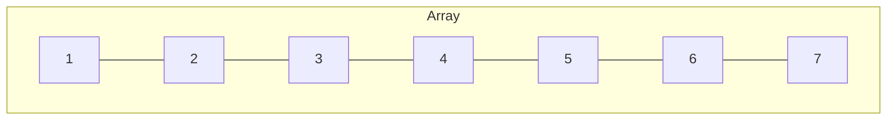
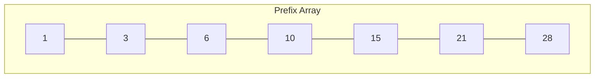

+++
title = 'Prefix Sum'
date = 2024-10-03T13:30:16+02:00
draft = false
math = true
authors = ["Johnathan Jacobs"]
summary = "An algorithm to find the sum of elements in multiple windows of an array more efficiently"
tags = ["dynamic-programming", "aggregation", "window", "prefix-sum"]
+++

Used to find the sum of elements in multiple windows of an array more efficiently.
Instead of summing the window (and redoing work) for each variation of the window
on the array,
we create an array where each element represents the sum of all previous elements
of the source array.
We then use this array to calculate the sums for the windows instead.



The prefix sum (calculated with `P[i] = A[0] + ... + A[i]`) would be:



Now any now the sum in a window can be calculated with `sum(i,j) = P[j]-P[i-1]`

This takes an $O(n*m)$ operation and makes it $O(n)$ at the cost of $O(n)$ space.

## Implementation

Here's a C++ implementation using nested loops to calculate the prefix sum:

```cpp
#include <vector>

std::vector<int> windowSums(const std::vector<int>& data,
                            const std::vector<std::pair<std::size_t,std::size_t>> windows) {
  const auto prefixSum = [&](){
    const auto size = data.size();
    std::vector<int> out(size);
    for(std::size_t i = 0; i < size; ++i) {
      for(std::size_t j = 0; j < i; ++j) {
        out[i] += data[j];
      }
    }
    return out;
  }();

  std::vector<int> sums;
  sums.reserve(windows.size());

  for(auto& window : windows) {
    sums.push_back(prefixSum[window.second] - prefixSum[window.first - 1]);
  }

  return sums;
}

int main() {
  return windowSums({1, 2, 3, 4, 5, 6, 7, 8},
                    {{1, 2}, {1, 3}, {1, 5}, {5, 7}}
                    )[0];
}
```

C++ provides `std::partial_sum` that simplifies the implementation:

```cpp
#include <vector>
#include <ranges>
#include <numeric> // for std::partial_sum

// NOTE: ideally std::partial_sum could be replaced with an std::ranges::inclusive_scan
std::vector<int> windowSums(const std::vector<int>& data,
                            const std::vector<std::pair<std::size_t, std::size_t>>& windows) {
  // Calculate the prefix sums
  std::vector<int> prefixSum(data.size() + 1, 0);  // One extra element for easy subtraction
  std::partial_sum(data.cbegin(), data.cend(), prefixSum.begin() + 1);

  // Compute sums for each window in windows
  return windows
    | std::views::transform([&](auto&& window) {
        return prefixSum[window.second] - prefixSum[window.first - 1];
    })
    | std::ranges::to<std::vector<int>>();
}

int main() {
  return windowSums(
      {1, 2, 3, 4, 5, 6, 7, 8},
      {{1, 2}, {1, 3}, {1, 5}, {5, 7}}
    )[1];
}
```
